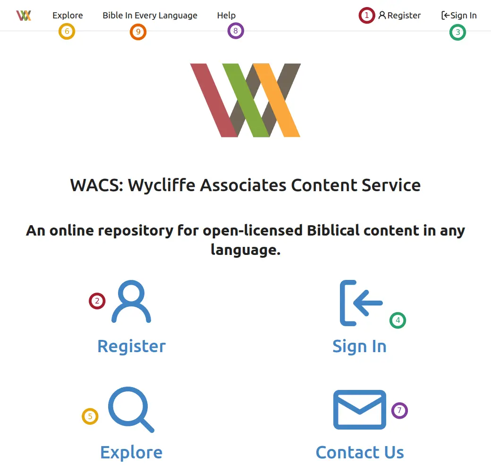

Using WACS
##########

WACS is a very useful tool, and can answer many questions about a translation project.

On this screen are several controls, but most of them are duplicates.

 ① and ② are both for **Registering** an account on WACS.

 ③ and ④ are both used for **Signing In** once you have an account.

 ⑤ and ⑥ are both for **Exploring** the content on WACS.

 ⑦ and ⑧ are both for **Getting Help** from us with regard to WACS. (They take you to the Help Desk.)

 ⑨ takes you to **Bible in Every Language**.